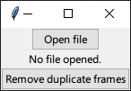

# Remove Duplicate Frames
A script to remove duplicate frames from videos. It is written in [Python](//python.org), its graphical user interface is made with [Tk interface](//docs.python.org/3/library/tkinter.html), and it removes duplicate frames from videos with [FFmpeg](//ffmpeg.org).

## Dependencies
Put an [FFmpeg](//ffmpeg.org/download.html) binary named `ffmpeg` in the script's directory. 

