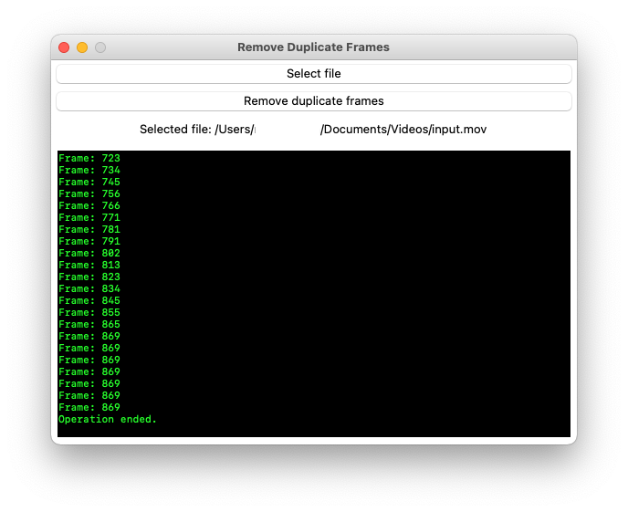

# Remove Duplicate Frames
## About
This app removes duplicate frames from an input video. It is written in [Python](//python.org), [`tkinter`](//docs.python.org/library/tkinter.html) is used for the graphical user interface, and it removes duplicate frames from input video with [FFmpeg](//ffmpeg.org).

## Dependencies
You must put [FFmpeg and FFprobe binaries](//ffmpeg.org/download.html) in the app's directory. The FFmpeg binary must be named `ffmpeg` and the FFprobe binary must be named `ffprobe`. 

